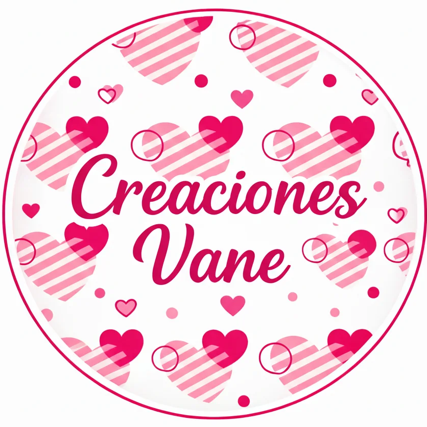
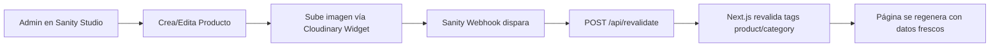

<p align="center">
  
</p>

<h1 align="center">🌸 Creaciones Vane</h1>

<p align="center">
  <strong>Tu cómplice que endulza momentos especiales</strong><br/>
  Landing page & catálogo e-commerce para empresa colombiana de regalos, desayunos sorpresa, decoraciones y refrigerios.
</p>

<p align="center">
  <a href="https://creacionesvane.com">🌐 creacionesvane.com</a> •
  <a href="https://wa.me/573128235654">💬 WhatsApp</a> •
  <a href="https://www.instagram.com/complice_que_endulza">📸 Instagram</a>
</p>

<p align="center">
  
  
  
  
  
  
  
</p>

---

## 📋 Líneas de Negocio

| Línea | Descripción | Ruta |
|-------|-------------|------|
| 💝 **Creaciones Vane** | Anchetas, desayunos sorpresa, ramos de rosas, peluches, cajas de chocolates | `/creaciones-vane` |
| 🎈 **Decoraciones Vane** | Decoración profesional de bodas, cumpleaños, baby shower, quinceañeras | `/decoraciones` |
| 🍱 **Refrigerios Vane** | Refrigerios individuales para eventos corporativos y fiestas | `/refrigerios` |

---

## 🚀 Stack Tecnológico

### Frontend
| Tecnología | Versión | Propósito |
|-----------|---------|-----------|
| **Next.js** | 16 (App Router) | Framework React con SSR/SSG |
| **React** | 19 | UI Library |
| **TypeScript** | 5.7 | Tipado estático |
| **Tailwind CSS** | 3.4 | Utilidades CSS |
| **Framer Motion** | 12 | Animaciones y transiciones |
| **Lucide React** | — | Iconografía SVG |
| **Google Fonts** | — | Poppins (UI) + Pacifico (script/decorativo) |

### CMS & Media
| Tecnología | Propósito |
|-----------|-----------|
| **Sanity.io** (v5) | Headless CMS — gestión de productos y categorías |
| **Cloudinary** | CDN de imágenes + widget de upload en Studio |
| **GROQ** | Queries tipadas para data fetching |
| **Sanity Webhooks** | Revalidación on-demand (ISR) |

### Infraestructura
| Servicio | Propósito |
|---------|-----------|
| **Vercel** | Hosting + Edge Functions + dominio custom |
| **Sanity Studio** | Desplegado en `creaciones-vane.sanity.studio` |

---

## 🎨 Arquitectura del Proyecto

```
creaciones-vane/
├── app/
│   ├── api/
│   │   └── revalidate/
│   │       └── route.ts              # Webhook Sanity → revalidación ISR
│   ├── components/
│   │   ├── Header.tsx                # Navbar responsive con menú móvil
│   │   ├── Footer.tsx                # Footer con enlaces y redes sociales
│   │   ├── ProductCard.tsx           # Tarjeta de producto con hover effects
│   │   ├── ProductCatalog.tsx        # Catálogo con filtros y paginación
│   │   ├── ProductModal.tsx          # Modal detalle de producto (full-screen)
│   │   ├── FilterSidebar.tsx         # Sidebar de filtros (desktop)
│   │   ├── MobileFiltersModal.tsx    # Modal de filtros (móvil)
│   │   ├── Pagination.tsx            # Paginación del catálogo
│   │   ├── InfiniteCarousel.tsx      # Carrusel infinito de productos
│   │   ├── WhatsAppButton.tsx        # Botón flotante WhatsApp
│   │   ├── WhatsAppChat.tsx          # Widget de chat WhatsApp
│   │   ├── ScrollReveal.tsx          # Wrapper de animación scroll-triggered
│   │   ├── PageTransition.tsx        # Transiciones entre páginas
│   │   ├── EmptyState.tsx            # Estado vacío para catálogos
│   │   └── WaterMark.tsx             # Marca de agua decorativa
│   ├── context/
│   │   └── ModalContext.tsx          # Provider global para modales
│   ├── data/
│   │   ├── constants.ts              # Constantes, opciones por categoría, Cloudinary helpers
│   │   └── mockData.ts              # Datos legacy (referencia, no se usa en producción)
│   ├── home-sections/
│   │   ├── HeroSection.tsx           # Hero con video background
│   │   ├── ServicesSection.tsx       # Tarjetas de categorías/servicios
│   │   ├── FeaturedProductsSection.tsx # Productos destacados (Sanity)
│   │   ├── LocationSection.tsx       # Mapa + zona de cobertura
│   │   ├── CTASection.tsx            # Call-to-action con WhatsApp
│   │   └── ExperienceSection.tsx     # Sección de experiencia / social proof
│   ├── hooks/
│   │   ├── index.ts                  # Barrel export
│   │   └── useProductCatalog.ts      # Hook de estado para catálogo (filtros, paginación, ordenamiento)
│   ├── lib/
│   │   ├── sanity.client.ts          # Instancia del Sanity Client
│   │   ├── sanity.queries.ts         # Queries GROQ reutilizables
│   │   └── sanity.types.ts           # Tipos TypeScript + función toProduct()
│   ├── creaciones-vane/
│   │   └── page.tsx                  # Catálogo "Detalles de Amor"
│   ├── decoraciones/
│   │   └── page.tsx                  # Catálogo "Decoración de Eventos"
│   ├── refrigerios/
│   │   └── page.tsx                  # Catálogo "Refrigerios"
│   ├── producto/
│   │   └── [slug]/
│   │       ├── page.tsx              # Página individual de producto (SSG)
│   │       └── ProductDetailClient.tsx # Client component del detalle
│   ├── politica-de-privacidad/
│   │   └── page.tsx                  # Página legal
│   ├── terminos-y-condiciones/
│   │   └── page.tsx                  # Página legal
│   ├── layout.tsx                    # Root layout + SEO global + JSON-LD Organization
│   ├── page.tsx                      # Home: Hero, Servicios, Destacados, Ubicación, CTA
│   ├── globals.css                   # Estilos globales + Tailwind
│   └── sitemap.ts                    # Sitemap dinámico para Google
├── public/
│   ├── logo.png                      # Logo circular principal
│   ├── logo-decoraciones.jpeg        # Logo línea Decoraciones
│   ├── logo-refrigerios.jpeg         # Logo línea Refrigerios
│   ├── banner-detalles.webp          # Banner hero Detalles
│   ├── banner-decoraciones.webp      # Banner hero Decoraciones
│   ├── banner-refrigerios.webp       # Banner hero Refrigerios
│   ├── robots.txt                    # Configuración de crawlers
│   ├── site.webmanifest              # PWA manifest
│   ├── favicon.ico / .svg            # Favicons multi-formato
│   ├── categorias/                   # Imágenes de categorías
│   ├── images/                       # Assets estáticos
│   └── videos/                       # Videos locales
├── vane-cms/                         # 🔶 Sanity Studio (proyecto independiente)
│   ├── schemaTypes/
│   │   ├── product.ts                # Schema: Producto (nombre, slug, precio, imagen, categoría)
│   │   ├── category.ts              # Schema: Categoría (nombre, valor, slug, subtítulo, ícono)
│   │   ├── cloudinaryField.ts       # Schema: Tipo custom para upload a Cloudinary
│   │   └── index.ts                  # Barrel export de schemas
│   ├── components/
│   │   └── CloudinaryUpload.tsx      # Widget de upload directo a Cloudinary desde Studio
│   ├── scripts/
│   │   └── migrate.ts               # Script de migración mockData → Sanity (80+ productos)
│   ├── sanity.config.ts             # Configuración del proyecto Sanity
│   ├── sanity.cli.ts                # CLI config
│   └── package.json                 # Dependencias del CMS
├── next.config.ts                    # Config Next.js (imágenes, headers seguridad, redirects)
├── tailwind.config.ts               # Paletas de color por línea de negocio
├── tsconfig.json
└── package.json
```

---

## 🔍 SEO & Performance

### Optimizaciones implementadas

| Área | Implementación |
|------|---------------|
| **Metadata** | Title templates, meta descriptions con CTA, keywords geo-localizadas por página |
| **JSON-LD** | Organization, LocalBusiness, WebSite, BreadcrumbList, FAQPage, Product, Service |
| **Open Graph** | Imágenes optimizadas 1200×630, locale `es_CO`, datos por página |
| **Twitter Cards** | Summary large image con descripciones únicas |
| **Geo Tags** | `geo.region`, `geo.position`, `ICBM`, Dublin Core coverage |
| **Sitemap** | Dinámico con prioridades y frecuencias de cambio |
| **robots.txt** | Reglas por crawler (Googlebot, Bingbot, redes sociales), bloqueo de scrapers |
| **Canonical URLs** | URLs canónicas en todas las páginas |
| **Security Headers** | HSTS, X-Content-Type-Options, X-Frame-Options, Referrer-Policy |
| **Google Search Console** | Verificación integrada en metadata |
| **PWA** | Web manifest con iconos 192px y 512px |

### Performance

- ⚡ **Imágenes**: Formatos AVIF/WebP, optimización con `next/image`
- ⚡ **Fonts**: `display: swap` + preload con `next/font/google`
- ⚡ **Preconnect**: Cloudinary y Google Fonts
- ⚡ **ISR**: Revalidación on-demand via Sanity webhooks
- ⚡ **SSG**: Páginas de productos pre-renderizadas con `generateStaticParams`
- ⚡ **Compression**: Habilitada en Next.js config
- ⚡ **Cache**: Headers `immutable` para assets estáticos (1 año)
- ⚡ **Package Optimization**: Tree-shaking de Framer Motion

---

## 🎨 Sistema de Diseño

### Paleta de Colores por Línea

```
┌──────────────────────────────────────────────────────────┐
│  💝 Creaciones Vane (Primary)                            │
│  ██ #e21c65  Fucsia principal                            │
│  ██ #fb7199  Rosa claro                                  │
│  ██ #bf1156  Fucsia oscuro                               │
│  ██ #f53e79  Rosa intermedio (secondary)                 │
├──────────────────────────────────────────────────────────┤
│  🍱 Refrigerios Vane                                     │
│  ██ #e87c24  Naranja (del logo)                          │
│  ██ #D99C52  Tono pan/bread                              │
│  ██ #92BC4C  Verde natural                               │
│  ██ #D14B33  Rojo acento                                 │
├──────────────────────────────────────────────────────────┤
│  🎈 Decoraciones Vane                                    │
│  ██ #800080  Púrpura principal                           │
│  ██ #FF85A2  Rosa borde                                  │
│  ██ #B39DDB  Lila                                        │
│  ██ #A0E7E5  Cian claro                                  │
│  ██ #FFD633  Amarillo                                    │
│  ██ #95E06C  Verde lima                                  │
└──────────────────────────────────────────────────────────┘
```

### Tipografía
- **Poppins** → Cuerpo de texto, headings, UI general
- **Pacifico** → Títulos decorativos, slogan, acentos de marca

---

## 🏗️ CMS & Flujo de Contenido

### Sanity Studio (`vane-cms/`)

El CMS está configurado como proyecto independiente con deploy en `creaciones-vane.sanity.studio`. Permite a la administradora gestionar contenido desde cualquier dispositivo (optimizado para móvil).

#### Schemas

| Schema | Campos principales |
|--------|-------------------|
| **Product** | nombre, slug, descripción, precio (COP), imagen (Cloudinary), categoría (ref), destacado, legacyId |
| **Category** | nombre, valor interno, slug, subtítulo, descripción, ícono, ruta |
| **CloudinaryUpload** | Tipo custom con widget de upload directo (`secure_url`, `public_id`) |

#### Flujo de Contenido



#### Migración

Se incluye un script de migración (`vane-cms/scripts/migrate.ts`) que importó los 80+ productos originales de `mockData.ts` a Sanity, preservando los `legacyId` para compatibilidad.

---

## 🛠️ Instalación y Desarrollo

### Prerrequisitos
- **Node.js** 18+
- **npm** o **yarn**

### 1. Frontend (Next.js)

```bash
# Clonar repositorio
git clone https://github.com/Diego-programand/CreacionesVane.git
cd creaciones-vane

# Instalar dependencias
npm install

# Configurar variables de entorno
cp .env.local.example .env.local
# Editar con tus credenciales de Sanity y Cloudinary
```

#### Variables de entorno requeridas

```env
# Sanity
NEXT_PUBLIC_SANITY_PROJECT_ID=nh1i4g00
NEXT_PUBLIC_SANITY_DATASET=production
SANITY_REVALIDATE_SECRET=<tu-secret-para-webhooks>

# Cloudinary
NEXT_PUBLIC_CLOUDINARY_CLOUD_NAME=<tu-cloud-name>
```

```bash
# Servidor de desarrollo
npm run dev
```

Abre [http://localhost:3000](http://localhost:3000) en tu navegador.

### 2. CMS (Sanity Studio)

```bash
cd vane-cms

# Instalar dependencias
npm install

# Servidor de desarrollo del Studio
npm run dev
```

Abre [http://localhost:3333](http://localhost:3333) para acceder al Studio.

### Scripts disponibles

| Comando | Descripción |
|---------|-------------|
| `npm run dev` | Inicia el servidor de desarrollo Next.js |
| `npm run build` | Build de producción |
| `npm run start` | Sirve el build de producción |
| `npm run lint` | Ejecuta ESLint |
| `cd vane-cms && npm run dev` | Inicia Sanity Studio local |
| `cd vane-cms && npm run deploy` | Despliega Sanity Studio |
| `cd vane-cms && npm run migrate` | Ejecuta migración de datos |

---

## 🗺️ Mapa de Rutas

```
/                           → Landing principal (Hero + Servicios + Destacados + Ubicación + CTA)
/creaciones-vane            → Catálogo: Detalles de Amor (anchetas, desayunos, ramos, peluches)
/decoraciones               → Catálogo: Decoración de Eventos (bodas, cumpleaños, baby shower)
/refrigerios                → Catálogo: Refrigerios para Eventos
/producto/[slug]            → Detalle individual de producto (SSG)
/politica-de-privacidad     → Política de Privacidad
/terminos-y-condiciones     → Términos y Condiciones
/api/revalidate             → Webhook endpoint para Sanity (POST)
/sitemap.xml                → Sitemap dinámico
/robots.txt                 → Configuración de crawlers
```

---

## 📱 Contacto

| Canal | Enlace |
|-------|--------|
| 📱 **WhatsApp** | [+57 312 823 5654](https://wa.me/573128235654) |
| 📸 **Instagram** | [@complice_que_endulza](https://www.instagram.com/complice_que_endulza) |
| 📘 **Facebook** | [Creaciones Vane](https://www.facebook.com/creaciones2927) |
| 🎵 **TikTok** | [@creacionesvane01](https://www.tiktok.com/@creacionesvane01) |
| 📍 **Ubicación** | Cra. 50 #120-13, Medellín, Colombia |
| 🌐 **Web** | [creacionesvane.com](https://creacionesvane.com) |

---

## 👨‍💻 Desarrollador

Proyecto diseñado y desarrollado por **Diego** — [OwlyDev](https://owlydev.com)

---

<p align="center">
  <strong>Creaciones Vane</strong> — Desde 2019 endulzando momentos especiales 💝
</p>
